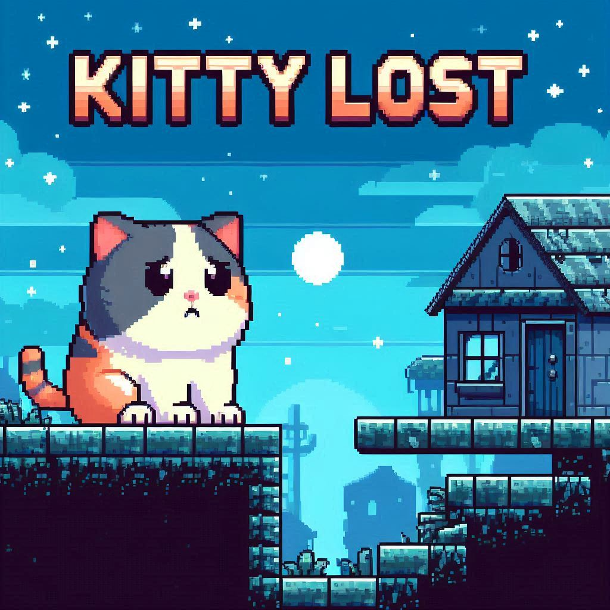

# KittyLost : Help the kitty to find his way ! 

A [libGDX](https://libgdx.com/) project generated with [gdx-liftoff](https://github.com/libgdx/gdx-liftoff).

This project was generated with a template including simple application launchers and an `ApplicationAdapter` extension that draws libGDX logo.

## Description

Kittylost is a 2D plateform game, the player (cat) has to find the way to go back home. The player needs to avoid pics, water and falling down. Collect fish to enhance your score! The player win when he goes through all the map! The higer the score is the better it is ! The less number of time you die the better it is ! Pay attention to traps !

## Fonctionnalities

- Maps : The game is composed by a large map with different theme. It gets more complicate/complex over time. 
- Score : Collect fish to enhance your score. The score max is 100 fishes 
- Obstacle : Avoid water, pics, quicksand and falling down .

## Playing mechanics

### Movements :

For an azerty keyboard:

 - Jump : Z
- Move forward : D
- Move backward : Q

For a qwerty keyboard:

 - Jump : W
- Move forward : A
- Move backward : Q

### Characters: 

- Hero : The player is a kitty (Poticha).

### To launch the game: 
In a terminal cd to the principal file and launch with this command line: 
JAVA_HOME=$(/usr/libexec/java_home -v 17) ./gradlew lwjgl3:run

or execute the main script in a IDE 

(Java 17 required) 

This game may get on your nerves, that's the goal! That's way there is no checkpoint Only the most motivated person can win this game ! It's a cute but frustrating game. Be the best and the most tenacious! 

May the fish be with you ! 

## Platforms

- `core`: Main module with the application logic shared by all platforms.
- `lwjgl3`: Primary desktop platform using LWJGL3; was called 'desktop' in older docs.

## Gradle

This project uses [Gradle](https://gradle.org/) to manage dependencies.
The Gradle wrapper was included, so you can run Gradle tasks using `gradlew.bat` or `./gradlew` commands.
Useful Gradle tasks and flags:

- `--continue`: when using this flag, errors will not stop the tasks from running.
- `--daemon`: thanks to this flag, Gradle daemon will be used to run chosen tasks.
- `--offline`: when using this flag, cached dependency archives will be used.
- `--refresh-dependencies`: this flag forces validation of all dependencies. Useful for snapshot versions.
- `build`: builds sources and archives of every project.
- `cleanEclipse`: removes Eclipse project data.
- `cleanIdea`: removes IntelliJ project data.
- `clean`: removes `build` folders, which store compiled classes and built archives.
- `eclipse`: generates Eclipse project data.
- `idea`: generates IntelliJ project data.
- `lwjgl3:jar`: builds application's runnable jar, which can be found at `lwjgl3/build/libs`.
- `lwjgl3:run`: starts the application.
- `test`: runs unit tests (if any).

Note that most tasks that are not specific to a single project can be run with `name:` prefix, where the `name` should be replaced with the ID of a specific project.
For example, `core:clean` removes `build` folder only from the `core` project.
